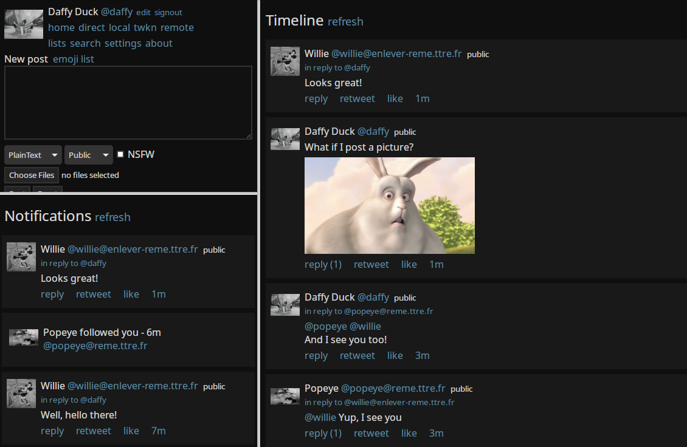

<!--
NOTA: Este README foi creado automáticamente por <https://github.com/YunoHost/apps/tree/master/tools/readme_generator>
NON debe editarse manualmente.
-->

# Bloat para YunoHost

[](https://ci-apps.yunohost.org/ci/apps/bloat/)


[](https://install-app.yunohost.org/?app=bloat)

*[Le este README en outros idiomas.](./ALL_README.md)*

> *Este paquete permíteche instalar Bloat de xeito rápido e doado nun servidor YunoHost.*  
> *Se non usas YunoHost, le a [documentación](https://yunohost.org/install) para saber como instalalo.*

## Vista xeral

bloat - A web client for Mastadon Network[1]

Features:

- Does not require JavaScript to display text, images, audio and videos.

[1] https://pleroma.social


**Versión proporcionada:** 1.0~ynh1

## Capturas de pantalla



## Documentación e recursos

- Documentación oficial para admin: <https://git.freesoftwareextremist.com/bloat/tree/README>
- Repositorio de orixe do código: <https://git.freesoftwareextremist.com/bloat/>
- Tenda YunoHost: <https://apps.yunohost.org/app/bloat>
- Informar dun problema: <https://github.com/YunoHost-Apps/bloat_ynh/issues>

## Info de desenvolvemento

Envía a túa colaboración á [rama `testing`](https://github.com/YunoHost-Apps/bloat_ynh/tree/testing).

Para probar a rama `testing`, procede deste xeito:

```bash
sudo yunohost app install https://github.com/YunoHost-Apps/bloat_ynh/tree/testing --debug
ou
sudo yunohost app upgrade bloat -u https://github.com/YunoHost-Apps/bloat_ynh/tree/testing --debug
```

**Máis info sobre o empaquetado da app:** <https://yunohost.org/packaging_apps>
